# hosaka Architecture

A local, near-real-time text-to-speech tool for a single user on a Blackwell
RTX 5070 Ti under WSL2. Type a line, hear it. Choose and tune the voice;
clone voices; design new voices from a text description.

## Shape

Read left to right: voice data is authored, an engine renders PCM, the
server fans it to clients, clients play it. Solid arrows are that forward
audio flow; dotted arrows are the speech requests that travel back upstream.

```mermaid
flowchart LR
    bake["bake CLI<br/>(hosaka.cli.bake, isolated venv)"]
    library[("voice library<br/>~/.local/share/hosaka/voices")]
    pmodels[("piper models<br/>~/.local/share/hosaka/piper")]
    kokoro["KokoroEngine<br/>(presets, realtime)"]
    chatter["ChatterboxEngine<br/>(cloning, quality)"]
    piper["PiperEngine<br/>(character voices)"]
    sidecar["piper_sidecar<br/>(.venv-piper, CPU)"]
    server["FastAPI server<br/>(hosaka.server, 127.0.0.1:8123)"]
    repl["REPL client<br/>(hosaka.cli.repl)"]
    proxy["exec-fn proxy<br/>(wai-lau.net/hosaka,<br/>SSH tunnel + cookie auth)"]
    web["web client<br/>(hosaka/web, /app/)"]
    win(["Windows speakers"])
    linux(["native-Linux speakers"])
    browser(["browser audio<br/>(AudioWorklet)"])

    %% forward: audio production pipeline, all left-to-right
    bake -->|"Parler → seed.wav"| library
    library -->|"reference WAV"| chatter
    kokoro -->|"PCM"| server
    chatter -->|"PCM"| server
    pmodels -->|"onnx voice"| sidecar
    sidecar -->|"framed PCM (pipe)"| piper
    piper -->|"PCM"| server
    server -->|"HTTP /v1/audio/speech<br/>raw PCM 24kHz mono f32 LE"| repl
    server -->|"WS over SSH tunnel"| proxy
    proxy -->|"WS /v1/audio/stream"| web
    repl -->|"ffplay.exe (WSLg)"| win
    repl -.->|"pacat (native-Linux path)"| linux
    web -->|"AudioWorklet PCM"| browser

    %% backward: speech requests (control)
    repl -.->|"speech request"| server
    web -.->|"speech request"| proxy
```

Three deployable units, each with one clear responsibility:

1. **Server** (`hosaka/server/`) — holds the two GPU models resident in VRAM,
   exposes an OpenAI-shaped HTTP API, streams raw PCM. It also spawns and talks
   to a CPU-only **Piper sidecar** (`.venv-piper`) for neural character voices;
   the server venv itself never imports piper.
2. **REPL client** (`hosaka/cli/repl.py`) — connects to the server (deferring to
   the systemd unit, spawning its own only as a fallback), reads lines, pipes
   streamed PCM into `pacat`.
3. **Bake CLI** (`hosaka/cli/bake.py`) — offline, isolated venv; turns a text
   voice description into a clone-able seed WAV.

## Three engines, one decision

No single open model does presets + cloning + tuning + style-prompt + character
voices AND hits <1s on this card. So the work is split:

| Engine | Role | Why | Latency on this box |
|--------|------|-----|---------------------|
| **Kokoro-82M** | presets + the realtime path | tiny, fast, ~28 English voices | ~60ms to first audio |
| **Chatterbox** (original, `davidbrowne17/chatterbox-streaming`) | cloning + tuning | best open zero-shot clone, keeps `exaggeration`/`cfg_weight`/`temperature` | RTF ~0.8; ~4s to first audio (see below) |
| **Piper** (VITS, CPU) | fixed character voices (GLaDOS) | pretrained single-speaker `.onnx` voices, non-autoregressive — runs off-GPU and beats realtime | RTF 0.04-0.2; ~40-80ms to first audio |
| **Parler-TTS Mini** (offline) | style-prompt voice authoring | only model that designs a voice from words | irrelevant (offline) |

Kokoro and Chatterbox stay pinned in VRAM (~5-6 GB of 16); Piper runs CPU-only
(models in RAM) in an isolated sidecar, so it never competes for VRAM and could
run concurrently with the GPU engines.

### The bake-once idea

Text style-prompt models generate autoregressively — multi-second per utterance,
every time. So they cannot serve the live path. Instead the slow step runs
**once, offline**: `bake` synthesizes a seed WAV matching a description, which
joins the voice library and is then cloned live by Chatterbox. Per-utterance,
the path is always a fast engine.

### Realtime vs quality (the hard constraint)

Benchmarked on the 5070 Ti + WSL2:

- **Kokoro = realtime.** RTF ~0.04, ~60ms first chunk. The live path.
- **Chatterbox = quality mode.** Measured RTF **~0.8** (0.74-0.92 across 0.8-13s
  fragments, T3 token LLM ~89% of it, small ~0.4s per-call overhead) — i.e.
  *faster than realtime*, just not sub-second. The model delivers each fragment
  **whole** (`ChatterboxEngine.stream()` generates in full, then hands back the
  waveform); per-chunk streaming *within* a fragment underruns and is avoided on
  purpose. The latency that remains is the first fragment's full generation, so
  the chunker **ramps** the fragment cap (see Request path step 3): a short first
  fragment reaches first audio in ~3-4s, and because RTF < 1 every later fragment
  finishes generating before the previous one finishes playing, so playback stays
  gapless. Full knob set retained. (An earlier RTF ~1.0 / "~2s overhead" reading
  was a one-off GPU degrading toward a CUDA crash, not normal operation.)

Fast realtime cloning is a deferred follow-up: **Chatterbox-Turbo** (now on HF,
distilled 1-step vocoder, 350M, ~RTF 0.5) or XTTS-v2 — a model swap with quality
re-validation, not a kernel tweak (bf16 does not help here: T3 is overhead-bound,
not flop-bound, and a full bf16 cast crashes the s3tokenizer FFT).

### Character voices (Piper)

GLaDOS and other fixed characters are not clones — they are pretrained
single-speaker Piper/VITS `.onnx` voices (e.g. `DavesArmoury/GLaDOS_TTS`,
fine-tuned on Portal 1/2 lines). Piper is non-autoregressive (one parallel
forward pass), CPU-only and
small, so it reaches first audio in ~40-80ms warm and runs ~5-25x realtime —
faster than either GPU engine, and entirely off the GPU.

Because piper's deps (onnxruntime, its own numpy) must stay out of the server
venv, the model runs in an out-of-process **sidecar** under `.venv-piper`
(`hosaka/server/engines/piper_sidecar.py`). The in-process `PiperEngine` is a
thin client: it spawns the sidecar once (model stays resident → warm latency),
writes one JSON request per fragment over the pipe, and reads back tagged,
length-prefixed float32 frames (`piper_proto.py`); the sidecar resamples each
sentence 22.05k→24k. One sidecar serves multiple voices (the request carries the
voice id), so adding a character = drop a model + one `PIPER_VOICES` entry in
`config.py`. If `.venv-piper` or the model files are absent the engine is simply
not built and the server runs Kokoro + Chatterbox as before. Piper is CPU-bound
but for now still routes through the same GPU admission queue as the other
backends (serialized); letting it bypass the queue is a possible follow-up.

## Request path

`POST /v1/audio/speech` →

1. Resolve the backend (`400` if unknown).
2. Admit to the bounded request queue, then wait for the single-GPU slot.
   Concurrent callers line up FIFO and are served one at a time; the cap check +
   reserve are atomic (no `await` between them), so they can't both slip past a
   full queue. Only when the queue is full (depth `MAX_QUEUE`) does a request get
   `503`.
3. Apply the custom-pronunciation lexicon (`hosaka/lexicon.py`), then split
   `input` into fragments (`hosaka/chunking.py`). For the Chatterbox path the
   cap **ramps** — fragment `k` is capped at `min(CHATTERBOX_MAX_CHARS,
   ceil(FIRST_FRAGMENT_MAX_CHARS * FRAGMENT_GROWTH**k))` — so the first fragment
   is small (fast first audio) and each later one stays inside the gapless budget
   at RTF ~0.8. This fragment-size schedule, not any model "streaming" flag, is
   the real low-latency lever. Kokoro keeps the plain sentence split (it streams
   sub-fragment audio itself).
4. For each fragment: run the blocking `engine.stream()` in a worker thread
   (`run_in_executor`), pushing PCM bytes (or an exception) into an
   `asyncio.Queue`; an async generator drains the queue into a `StreamingResponse`.
5. The GPU slot is held until the worker thread has actually finished (the future
   is `shield`-awaited), even on client disconnect — preserving the single-GPU
   serialization invariant and surfacing engine errors instead of returning a
   silently truncated `200`.

`WS /v1/audio/stream` is the persistent-session variant for a web client: each
JSON message (`SpeechRequest` shape) is one utterance; the server replies with a
`{"type":"start"}` marker, raw PCM binary frames, then `{"type":"end"}`. A
malformed / unknown-voice / over-cap request gets `{"type":"error"}` and leaves
the socket open. It shares the same `_resolve` validation, `_GpuQueue` admission
and `_pcm_frames` streaming core as the HTTP route -- only the transport differs.

A minimal browser demo client is bundled at `/app/` (`hosaka/web/`): an
AudioWorklet PCM player driven by the WebSocket endpoint. It is a reference /
local-test client; a real front end (e.g. on a public host) can lift the same
two files.

Other endpoints: `GET /health` (ready when the models are warmed),
`GET /v1/voices` (presets + library clips + Piper character voices),
`POST /shutdown` (clean `:quit --stop`).

## Data + audio

- **Audio contract:** raw PCM, 24 kHz, mono, float32 LE, everywhere. Engines
  resample to 24 kHz if a model differs.
- **Voice library** (`hosaka/library.py`): a directory of seed WAVs +
  `manifest.json` mapping voice-id → {path, source, params, created}. Lives in
  `~/.local/share/hosaka/voices` — outside the repo, so personal recordings never
  enter git. The repo ships a couple of Kokoro-rendered sample seeds.
- **Piper models** (`~/.local/share/hosaka/piper/<voice>/`): pretrained `.onnx`
  + `.onnx.json` character voices, untracked (weights are large; the Portal
  training audio is Valve copyright). Fetched by `scripts/fetch_glados_model.sh`;
  registered in `config.PIPER_VOICES`.
- **Pronunciation lexicon** (`hosaka/lexicon.py`): a flat `{word: respelling}`
  JSON at `~/.local/share/hosaka/lexicon.json` (untracked, alongside the voice
  library). Applied to `input` before chunking on every path (HTTP, WS, REPL,
  web) so it covers both backends — Kokoro and Chatterbox are plain text-driven,
  so respelling to a homophone (`Wai` → `Way`) is the one engine-agnostic lever.
  Matching is whole-word + case-insensitive; the server mtime-caches the file and
  recompiles only on edit. Managed live from the REPL via `:pron`.
- **Audio out** (`hosaka/audio.py`): `make_player()` picks the path. Native
  Linux → `PacatPlayer` (`pacat --raw`, PulseAudio). Under WSLg the RDP audio
  bridge adds static to all in-WSL playback, so audio plays on the **Windows**
  side instead: `FfplayPlayer` streams float32 PCM into a persistent `ffplay.exe`
  (gapless — fragment N plays while N+1 synthesizes, with a `PIPELINE_LEAD_MS`
  cushion for Chatterbox's RTF ~1), falling back to `WinSoundPlayer` (whole-WAV
  per utterance) if ffmpeg isn't on the Windows side.

## VRAM lifecycle

On server start the lifespan hook best-effort `ollama stop gpt-oss:20b` to free
VRAM, then loads and warms the GPU models (a tiny synth each) so the first real
request is not a cold start. Models stay pinned for the session. Warmup also
spawns the Piper sidecar and warms each character voice (loaded into RAM, not
VRAM), so its first request is warm too.

## Running it / startup

`scripts/start_server.sh` is the canonical launcher (uvicorn on
`127.0.0.1:8123`). It runs on WSL startup via the systemd *user* unit
`hosaka-server.service` (tracked under `scripts/systemd/`); `loginctl
enable-linger` makes it come up at boot without an interactive login. If the
server is down, the REPL defers to systemd when the unit is installed — waiting
for it, or starting it via `systemctl --user start` — and spawns its own
process only as a fallback when no unit exists, so it never competes with the
unit for the port. The decision is the pure `_startup_action` in `repl.py`.

## Remote / web access

The server binds loopback only. For remote use it is consumed by a separate app
(exec-fn, served at `wai-lau.net/hosaka`) that reverse-proxies the WebSocket to
this box over an SSH tunnel and gates it behind that app's session-cookie auth —
no ports are opened on the home box. The bundled `/app/` client is for local
testing.

## Why three venvs

`.venv-server`, the bake CLI (`.venv-bake`) and the Piper sidecar (`.venv-piper`)
are separate Python environments. Parler hard-pins an old `transformers`, and
Chatterbox needs `transformers==4.46.3`; keeping Parler isolated means its
dependency constraints can never poison the live server. Piper pulls
`onnxruntime` + its own numpy; even though those happen to be compatible today,
isolating them keeps the delicate torch/Kokoro/Chatterbox stack untouchable, and
lets piper stay a CPU-only process. Both side environments communicate with the
server only out-of-process — bake writes a WAV to disk, the Piper sidecar streams
PCM over a pipe — and the server venv imports neither Parler nor piper. See
`scripts/setup_server_venv.sh`, `scripts/setup_bake_venv.sh` and
`scripts/setup_piper_venv.sh` for the exact recipes.

## Module map

| Path | Responsibility |
|------|----------------|
| `hosaka/config.py` | constants: sample rate, ports, paths, defaults |
| `hosaka/chunking.py` | sentence-fragment splitter (low-latency lever) |
| `hosaka/lexicon.py` | custom-pronunciation respelling map (applied pre-chunk) |
| `hosaka/library.py` | voice library + JSON manifest |
| `hosaka/schemas.py` | request/response models, param clamping |
| `hosaka/audio.py` | playback players (ffplay / pacat / winsound) + `make_player` selection |
| `hosaka/server/app.py` | FastAPI app: lifespan, routes, GPU serialization |
| `hosaka/server/main.py` | wires engines + library into the app (uvicorn entry) |
| `hosaka/server/engines/base.py` | `Engine` protocol + `EngineRegistry` |
| `hosaka/server/engines/kokoro_engine.py` | Kokoro presets engine |
| `hosaka/server/engines/chatterbox_engine.py` | Chatterbox cloning (quality mode) |
| `hosaka/server/engines/piper_engine.py` | Piper sidecar client (character voices) |
| `hosaka/server/engines/piper_sidecar.py` | Piper synth worker (runs in `.venv-piper`) |
| `hosaka/server/engines/piper_proto.py` | pipe wire protocol shared by both |
| `hosaka/cli/replcmd.py` | REPL colon-command parser |
| `hosaka/cli/repl.py` | REPL client (auto-spawn, stream, play) |
| `hosaka/cli/bake.py` | offline Parler voice-bake CLI |
| `scripts/` | venv setup, GPU verify, latency benchmark, e2e smoke |
